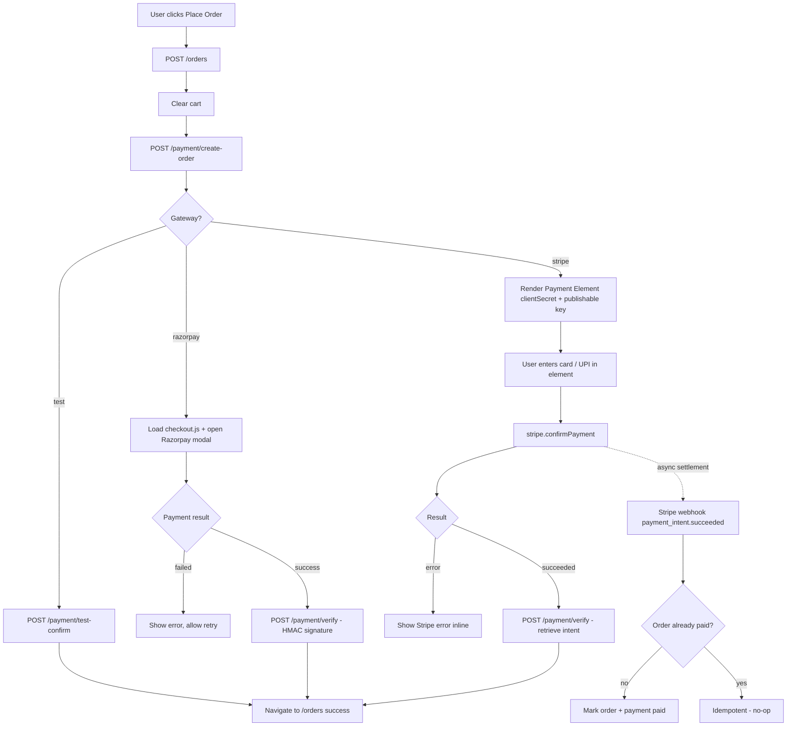
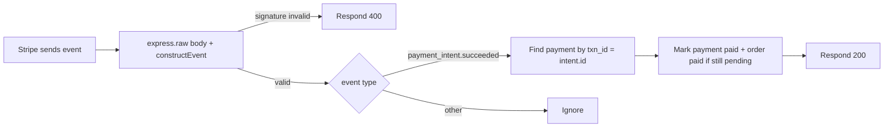

# Multi-Gateway Payments — Implementation Plan (Phase 19)

**Status: AWAITING APPROVAL**

Scope: Support Indian + international payments with a single admin-selectable active gateway.

- **Razorpay** — India. UPI/cards/netbanking/wallets via its checkout modal (UPI included).
- **Stripe** — International. Embedded Payment Element via `@stripe/react-stripe-js`; supports UPI where Stripe enables it.
- **Test** — sandbox fallback when no gateway is configured.

### Decisions (confirmed with user)

| Topic | Decision |
|---|---|
| UPI | Offered inside Razorpay modal (India) + Stripe Payment Element (international, where enabled). No standalone UPI gateway. |
| Stripe UI | Embedded Payment Element (no redirect, stays inside our full-width layouts). |
| Gateway selection | Admin picks a single active gateway: `razorpay \| stripe \| test`. |
| Stripe verification | Webhook (`payment_intent.succeeded`) as authoritative reconciliation + server-side PaymentIntent retrieve in `POST /api/payment/verify` for immediate client feedback (works in dev without a tunnel). |

---

## Backend changes

| Area | Change |
|---|---|
| `server/src/controllers/settingsController.js` | Add `DEFAULTS`: `payment_gateway` (`razorpay`), `payment_currency` (`INR`), `razorpay_key_id`, `razorpay_key_secret`, `stripe_secret_key`, `stripe_publishable_key`, `stripe_webhook_secret`. Credentials resolve from settings, falling back to existing env vars. |
| DB | Add `payments.currency VARCHAR(10)` via `migrate.js` `addColumnIfMissing` + update `schema.sql`. |
| `server/src/services/payment/razorpay.js` (new) | `createOrder`, HMAC `verify`. UPI via modal — no extra work. |
| `server/src/services/payment/stripe.js` (new) | `createPaymentIntent` (automatic payment methods → UPI where enabled), `verify` (retrieve PI status), `webhook` (`constructEvent` on raw body, idempotent mark-paid). |
| `server/src/services/payment/index.js` (new) | Factory: active gateway from settings + sanitized public config (no secrets). |
| `server/src/controllers/paymentController.js` | Rewrite `createPayment` → `{ gateway, test, order_id, amount, currency, key_id \| client_secret+intent_id }`; gateway-aware `verifyPayment`; keep `testConfirm`; add `paymentConfig` + `stripeWebhook`. |
| `server/src/routes/payment.js` | Add public `GET /config` (before auth middleware); stripe verify branch. |
| `server/src/routes/adminPayment.js` (new) | `GET/PUT /api/admin/payment-config` — mirror `adminShipping.js` pattern; secrets masked; `configured` booleans. |
| `server/src/server.js` | Mount `POST /api/payment/webhook` with `express.raw({ type: 'application/json' })` **before** global `express.json()`; mount `adminPayment` routes. |
| `server/src/utils/schemas.js` | Gateway-aware `paymentVerifySchema`; `paymentConfigSchema` for admin PUT. |

## Frontend changes

| Area | Change |
|---|---|
| deps | `npm i stripe` (server); `npm i @stripe/stripe-js @stripe/react-stripe-js` (client). |
| `client/src/features/paymentSlice.js` (new) | `fetchPaymentConfig` + selectors. |
| `client/src/pages/Checkout.jsx` | Load config; `placeOrder` branches by `pay.gateway`: `test` → test-confirm; `razorpay` → existing modal (currency from config); `stripe` → store `clientSecret`/`intent_id`, render Payment Element, `confirmPayment` → `POST /payment/verify` → navigate. |
| `client/src/components/checkout/CheckoutLayouts.jsx` | Themed payment-method note in summary; swap Place-Order button for shared `<StripePaymentElement>` when a Stripe payment is in progress (all 3 templates). |
| `client/src/admin/AdminPayments.jsx` (new) | Radio cards Razorpay / Stripe / Test + currency + masked credential fields + configured badges (mirrors `AdminShipping`). |
| `client/src/App.jsx` | Route `/admin/payments`. |
| `client/src/admin/AdminLayout.jsx` | "Payments" nav link. |
| Order detail | Surface `payments.gateway`/status on `GET /orders/:id` (join). |

## API endpoints

| Method | Path | Auth | Purpose |
|---|---|---|---|
| GET | `/api/payment/config` | public | Active gateway + currency + public keys (sanitized). |
| POST | `/api/payment/create-order` | user | Create payment for an order (gateway-aware). |
| POST | `/api/payment/verify` | user | Verify (Razorpay HMAC / Stripe retrieve). |
| POST | `/api/payment/test-confirm` | user | Test-mode confirmation. |
| POST | `/api/payment/webhook` | Stripe sig | Stripe `payment_intent.succeeded` reconciliation. |
| GET/PUT | `/api/admin/payment-config` | admin | Read/update gateway config + credentials. |

## Settings keys

`payment_gateway`, `payment_currency`, `razorpay_key_id`, `razorpay_key_secret`, `stripe_secret_key`, `stripe_publishable_key`, `stripe_webhook_secret`.

---

## Workflow diagram

### Checkout payment flow (all gateways)



### Stripe webhook handling



---

## Verification

1. `npm run lint` (client + server); client `npm run build`.
2. `GET /api/payment/config` returns configured gateway/currency without secrets.
3. Admin → Payments page loads; switch gateway + save; credentials masked after save; `configured` badges update.
4. Checkout per template (marketplace / minimal / editorial):
   - **test** → order confirms and redirects to `/orders`.
   - **razorpay** → modal opens; success path verifies via HMAC.
   - **stripe** → Payment Element renders; confirm; verify via intent retrieve.
5. Webhook endpoint smoke test with `stripe` CLI (`stripe listen --forward-to localhost:5000/api/payment/webhook`).

## Notes / open items

- Live payments require real Razorpay/Stripe credentials; **test** mode works with none.
- Stripe webhook needs a public URL in production (tunnel/ngrok); `/verify` (server-side retrieve) provides immediate confirmation in dev.
- No coupon/discount backend exists — promo code stays removed from checkout.

---

## Sandbox / test keys — step-by-step setup

### 1. Razorpay test (sandbox) keys

> Razorpay test mode is **on by default** for new accounts. No test cards needed — the modal shows fake UPI/bank options, or you can use their test card `4111 1111 1111 1111`.

1. Create a free account at https://dashboard.razorpay.com (or use an existing one).
2. In the Dashboard, go to **Settings → API Keys** (top-right menu → Settings).
3. Click **Generate API Key** (Key ID + Key Secret). Copy both.
4. Keep the Key Secret private — it's only used server-side.
5. In this project: Admin → **Payments** → select **Razorpay** → paste **Key ID** and **Key Secret** → choose currency `INR` → Save.
6. Confirm it's working: `GET /api/payment/config` should return `"gateway": "razorpay"`. Place an order and complete the modal using the test card — order should become **paid**.
7. Go live later: Dashboard → Settings → **Switch to Live Mode** → generate live keys → paste them into Admin → Payments. (Keep test keys until then.)

> Webhook: Razorpay signature verification already happens inside `/api/payment/verify`, so **no Razorpay webhook setup is required**.

### 2. Stripe test keys

1. Create a free account at https://dashboard.stripe.com.
2. With **Test mode** toggled ON (top-right), go to **Developers → API keys**.
3. Copy the **Publishable key** (`pk_test_...`) and **Secret key** (`sk_test_...`).
4. In this project: Admin → **Payments** → select **Stripe** → paste both keys → choose currency (e.g. `USD`, `EUR`, `INR`) → Save.
5. Verify: `GET /api/payment/config` returns `"gateway": "stripe"` with the publishable key. At checkout the Stripe Payment Element renders; use Stripe's test card `4242 4242 4242 4242` (any future expiry / CVC).
6. **UPI inside Stripe**: Stripe only shows UPI as a payment method in regions where it's enabled (Stripe Dashboard → Payment methods → enable UPI where available for your account). This is a Stripe-side toggle, not a code change.

### 3. Stripe webhook secret (required for order confirmation)

> Two options — CLI (local dev) or Dashboard (production). Pick ONE.

**Option A — Stripe CLI (recommended for local dev)**

1. Install the CLI: https://stripe.com/docs/stripe-cli (Windows: `winget install --id Stripe.StripeCLI` or download the binary).
2. Run once to link your account:
   ```
   stripe login
   ```
3. Forward Stripe events to this server while the backend is running:
   ```
   stripe listen --forward-to localhost:5000/api/payment/webhook
   ```
   The CLI prints a `whsec_...` secret each session.
4. Copy that `whsec_...` value → Admin → **Payments** → **Stripe webhook secret** → Save.
5. Keep the CLI running while testing. When a payment succeeds, the CLI shows `payment_intent.succeeded` forwarded and the order flips to **paid**.
6. (Optional) Send a test event manually: `stripe trigger payment_intent.succeeded`.

**Option B — Dashboard webhook (production / no CLI)**

1. Stripe Dashboard → **Developers → Webhooks → Add endpoint**.
2. Endpoint URL: `https://your-domain.com/api/payment/webhook` (needs a public HTTPS URL — use a tunnel like `ngrok` in dev: `ngrok http 5000`).
3. Events: select **payment_intent.succeeded**.
4. Click **Add endpoint**, then **Reveal** the **Signing secret** (`whsec_...`).
5. Paste it → Admin → **Payments** → **Stripe webhook secret** → Save.
6. After a test payment, Stripe shows the delivery attempt in **Webhooks** → the endpoint's events tab.

### 4. Test-mode (no keys) fallback

- With no keys configured and gateway = **test**, checkout confirms instantly via `/api/payment/test-confirm` — no external accounts needed. This is the default out-of-the-box state.
